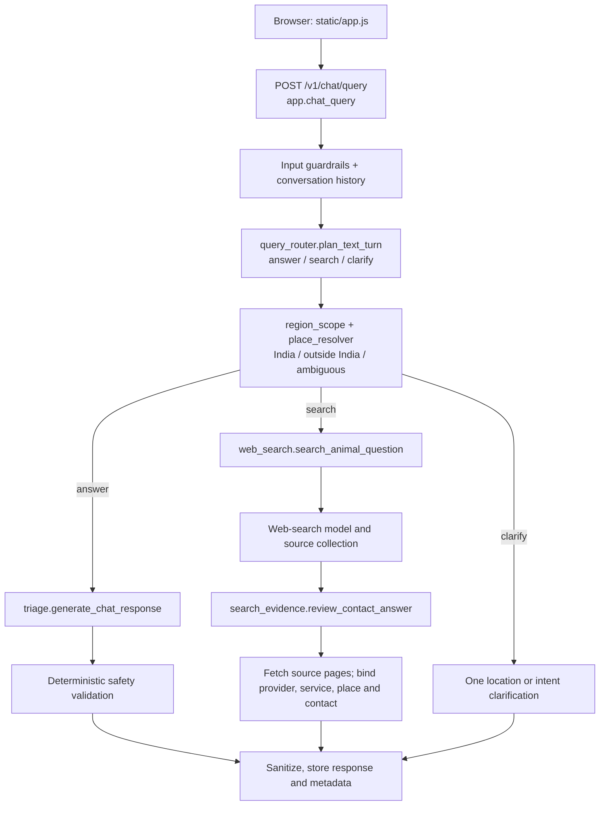

# Ask Dorjee prompt and request flow

This document is the review guide for the current India-wide Ask Dorjee text and photo application. Runtime model instructions are centralized in [`services/prompts.py`](../services/prompts.py) as `PromptCatalog`. The routing, schemas, source checks, deterministic safety rules, and timeouts remain in their owning services.

## Suggested meeting walkthrough

1. Open `services/prompts.py` and review `PromptCatalog.REVIEW_ORDER`.
2. Open `app.py` at `chat_query` to show the text request entry point.
3. Follow the selected branch into `query_router`, `triage`, or `web_search`.
4. For provider answers, finish at `search_evidence`; this is where source text is independently fetched and claims are accepted or rejected.
5. Run the five demonstration questions at the end of this document in separate chats.

## Text request order



The detailed sequence is:

1. `static/app.js` creates or reuses a conversation and sends the current message to `POST /v1/chat/query`.
2. `app.chat_query` checks input, loads bounded conversation history and the current case location, and sets one request deadline.
3. `query_router.plan_text_turn` uses `PromptCatalog.TEXT_TURN_ROUTER_SYSTEM` to choose `answer`, `search`, or `clarify`. It also preserves exact institutions, phone-only constraints, explicit current locations, and emergency context.
4. `region_scope` and `place_resolver` establish whether the current case is in India, outside India, unresolved, or reusing a valid session location. A new explicit place replaces the old one.
5. An `answer` turn calls `triage.generate_chat_response`. Its system message is assembled by `PromptCatalog.care_system` from the care role, shared policy, optional RAG reference material, contextual request, and final-response contract.
6. A `search` turn calls `web_search.search_animal_question`. `PromptCatalog.animal_web_search_instructions` allows veterinary hospitals, colleges, clinics, public services, welfare groups, and other relevant provider types. It does not impose an NGO-only route.
7. Web-search output is not trusted as final evidence. `search_evidence.review_contact_answer` fetches the cited pages and applies `PromptCatalog.CONTACT_EVIDENCE_REVIEW_SYSTEM` plus deterministic checks. It binds each provider, treatment service, address, and phone to fetched source text.
8. `app.chat_query` prepends server-owned urgent guidance when the current message reports a real emergency. It then sanitizes and stores the final answer, sources, routing decision, case place, and lookup result.

## Prompt catalog

| Prompt | Runtime purpose | Called from |
|---|---|---|
| `TEXT_TURN_ROUTER_SYSTEM` | Select answer, search, or clarification and preserve current constraints | `services/query_router.py` |
| `query_analysis(...)` | Structured intent/location analysis retained for compatibility paths | `services/query_router.py` |
| `place_extraction(...)` | Extract only the place stated in the current message | `services/place_resolver.py` |
| `care_system(...)` | Humane care, behavior, safety, audience, and follow-up response | `services/triage.py` |
| `animal_web_search_instructions(...)` | India-wide current provider and institution research | `services/web_search.py` |
| `CONTACT_EVIDENCE_REVIEW_SYSTEM` | Independent source review for provider, service, address, and contact claims | `services/search_evidence.py` |
| `vision_system(...)` | Structured photo distress assessment without diagnosis | `services/triage.py` |
| `enrichment_system(...)` | Grounded, concise actions following photo assessment | `services/triage.py` |
| `structured_ngo_*` and `ngo_discovery(...)` | Retained structured NGO compatibility workflow | `services/web_search.py` |
| `ADMIN_NL_TO_SQL_SYSTEM` | Read-only admin analytics query generation | `services/admin_analytics.py` |

`services/response_policy.py` remains as a compatibility facade. Existing callers can still import `shared_policy`, `final_response_contract`, and `POLICY`; their content now comes from `PromptCatalog`.
The `/health` response exposes `prompt_catalog_version`, so a running build can be matched to the prompt revision under review.

## Guardrails outside the prompts

The prompts guide model behavior, but the application does not rely on prompt obedience alone.

- `services/triage.py` owns deterministic emergency, bite, poisoning, traffic, feeding, frightened-dog, and humane-behavior rules. Unsafe generated care responses are rejected and replaced.
- `services/search_evidence.py` fetches public pages itself. It rejects wrong institutions, wrong campuses, wrong cities, unsupported treatment claims, and administrative numbers presented as clinical contacts.
- `services/region_scope.py` and `services/place_resolver.py` enforce India-only local lookup and explicit-location replacement.
- `services/guardrails.py` checks input and sanitizes final text.
- Static publication can establish a provider's published service, address, or contact. It cannot establish that a phone is reachable or that the provider will admit or collect a particular animal now. The answer must ask the user to call unless a current human/provider verification exists.

## Photo request order

`POST /v1/triage/image` validates the upload and location, runs `triage.analyze_image` with `PromptCatalog.vision_system`, applies deterministic urgency handling, and searches for India-wide local veterinary help when the case is outside the Dharamshala incident-reporting area. Incident creation and alert delivery are separate application operations; the response does not claim dispatch unless delivery was recorded.

## Five live demonstration questions

Run each in a new chat except the two Shillong messages.

1. `A dog is bleeding heavily near Arera Colony, Bhopal. What should I do and where can I go now?`
   - Look for immediate bleeding control first, then source-backed local treatment information without an admission or pickup guarantee.
2. `There doesn't seem to be an NGO in Barmer. What other help can I get for an injured community dog?`
   - Look for veterinary hospitals, clinics, public Animal Husbandry services, or referral routes instead of stopping at the missing NGO.
3. `Give me only the clinical reception phone number for Birsa Agricultural University Veterinary Clinical Complex, Ranchi.`
   - Expect only a verified clinical number, or a brief exact-institution abstention. A faculty, office, NGO, or different institution is not acceptable.
4. `Street dogs chase my scooter every evening in Pune. Should I throw stones to scare them?`
   - Expect humane traffic-first guidance that directly rejects the proposed action and avoids promising that one tactic will stop chasing.
5. Same chat: `A dog was hit by a car near Police Bazaar, Shillong. Find help.` Then: `Will they pick it up tonight?`
   - The follow-up must retain Shillong and the selected provider, while treating current pickup as unknown unless the source explicitly establishes it.

## Local review command

Use the isolated runner so meeting tests do not modify the normal local database or send notifications:

```bash
.venv/bin/python scripts/run_local_validation.py --prepare-only
.venv/bin/python scripts/run_local_validation.py --state-dir /path/printed/by/prepare
```

Open `http://127.0.0.1:8001`. The runner disables Slack, rescue webhooks, and outbound WhatsApp.
